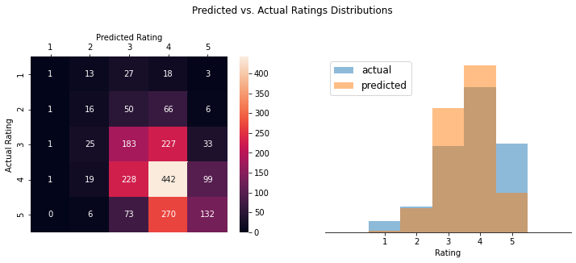

# Capstone Project - Recommending Restaurants
This project covers using the Yelp 2016 review set to recommend restaurants to users using various methods.  The aim is to recommend restaurants in a more personalised way than simply suggesting the top rating restaurants in a given city.  A blog writeup of the work here can be found on [Medium](https://medium.com/@paulgstubley/personalised-restaurant-recommendations-using-funksvd-3beff200b01c?source=friends_link&sk=08979761b0ece6de2c965b2880e048f8).

After some optimisation of the fitting parameters, we are able to predict ratings slightly more personalised than simply predicting the average-restaurant rating.

The issues of skewed and imbalanced training ratings are briefly discussed.

We also create a reasonably generic recommender python class which can be used for any ratings dataset that is 'one-row-per-review' to carry out recommendations based on top-rated and collaborative filtering using FunkSVD.  A minimal example of using this class is included in the `recommender.py` file's `main()` function.

## File structure

```
├── README.md
├── Data_Cleaning.ipynb                 - Data cleaning notebook
├── Restaurant_Recommender.ipynb        - Analysis notebook
├── recommender.py                      - Python class for the recommender function.
├── requirements.txt                    - Required python libraries
├── data                                - Cleaned input data (note raw data can be found at the link below)
│   ├── businesses_toronto.json             - Cleaned businesses data
│   └── toronto_reviews_sub.json            - Cleaned review data
└── images                              - Output images
    ├── Confusion.png
    ├── Toronto.html
    ├── latex.txt
    └── map.html
```

## Data cleaning

Full details can be found in the `Data_Cleaning` notebook, the raw Yelp review data can be downloaded [here](https://www.kaggle.com/yelp-dataset/yelp-dataset?select=yelp_academic_dataset_business.json).
Key steps include parsing business-category data, filtering to Toronto only, and selecting users who have reviewed more than 10 times since 2014.

The cleaned data is summarised below:

<p align="center">

</p>

A function which can encode, and simplify, complicated user/item IDs to a unique integer number is included in this notebook, but not used in the final analysis.

## Analysis

Full details can be found in the `Restaurant_Recommender` notebook.  Example outputs are shown below.

We can compare the predicted ratings with the actual ratings from the testing set.

<p align="center">

</p>

The recommender creates a map output with predicted ratings and links to an appropriate google search for more information.

<p align="center">

</p>

## Recommender Class

Full details can be found in the `recommender` script.

One key thing to note is that the `recommender.fit()` method uses [Numba](http://numba.pydata.org/), which increases the speed of the fit method by *~300X* (compared to the method introduced in the course). The top code-block runs the Numba-ised version of the fit method, the bottom code-block runs the original python version.

<p align="center">

</p>