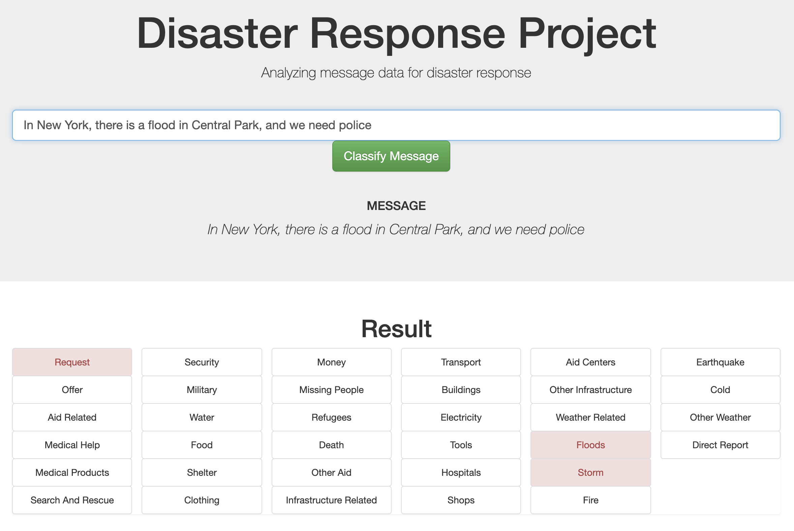

# Disaster Response Pipeline Project

## Context

As part of the Udacity DataScience Nanodegree (full repo [here](https://github.com/paul-stubley/Udacity)), I have been provided with labelled disaster-reponse message (social, news and direct messages).  The goal is to create a classifier app that can classify an unseen message into one or more of ~36 categories (e.g. Infrastructure, Earthquale, Food, Flood etc.).

## Example training input
> Weather update - a cold front from Cuba that could pass over Haiti

> Is the Hurricane over or is it not over

> Looking for someone but no name

> UN reports Leogane 80-90 destroyed. Only Hospital St. Croix functioning. Needs supplies desperately.

> Please, we need tents and water. We are in Silo, Thank you!

## Output

The output can be seen, and new messages can be classified, using this Heroku app. (Link TBD)

<p align="center">

</p>

## Details of project
### Data Cleansing ETL

This code is provided in `./data/process_data.py`.

The data is provided in two files, one containing the messages `./data/disaster_messages.csv`, and one containing the labelled categories `./data/disaster_categories.csv`.  Several cleansing steps are necessary:
- Create dummy variables for each of the categories.
- Remove duplicate rows.
- Remove categories which have no labelled data
    *(As we would never be able to predict them, and they cause some ML classifiers to fail).*
- Clean a few messages that have a value of >1 for a given category.
We then write this cleaned data to a local database (filename given as a runtime argument) here: `./data/DisasterResponse.db` in the table `disaster_response`

### The ML pipeline

This code is provided in `./models/train_classifier.py`.

The code ingests the data from the local database, then tokenises it, runs it through [TF-IDF](https://scikit-learn.org/stable/modules/generated/sklearn.feature_extraction.text.TfidfTransformer.html), and then in to one of a selection of classifiers.  The `sklearn` classifiers investigated are shown below alongside their scores (with default parameters):

| Classifier | accuracy* | precision  |  recall | f1-score  | support | fit-time (secs) |
|---|---|---|---|---|---|---|
|**Random Forest Classifier**| 0.25 | 0.76    |  0.50  |    0.54 |    20925 |- |
|**MultinomialNB**|   0.17 |  0.56   |   0.38    |  0.39   |  20711 | - |
|**LogisticRegression**|  0.29 | 0.78     | 0.55  |    0.60   | 20711| 43.44 |
|**StochasticGradientDecent**| 0.31 | 0.76  |    0.57  |    0.61  |   20459 | 29.97 |

\*the reason accuracy is low relative to the other score metrics is detailed [here](https://scikit-learn.org/stable/modules/generated/sklearn.metrics.accuracy_score.html), but in essence:

>In multilabel classification, this function computes subset accuracy: the set of labels predicted for a sample must exactly match the corresponding set of labels in y_true.

i.e. it has to get every single label right for each message, which is not necessarily the output we require, as long as it gets some right the classifier can still be useful.

### Grid Search

Having found a classifier we are happy with, we ran Cross Validation over a grid of the following parameters:
```
parameters = {
              'clf4__estimator__loss'    : ['hinge', 'log', 'modified_huber'],
              'clf4__estimator__alpha'   : [0.0001,0.001],
              'clf4__estimator__max_iter': [1000, 2000]
             }
```
and found that the `modified_huber` loss function improved the predictions of the test data, but that the other changes did not make a difference to the fit.
