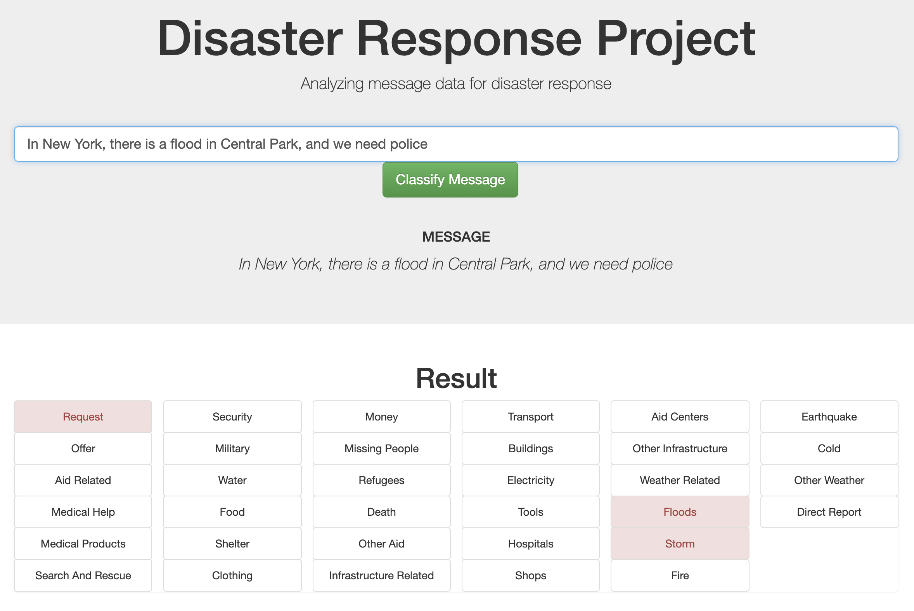
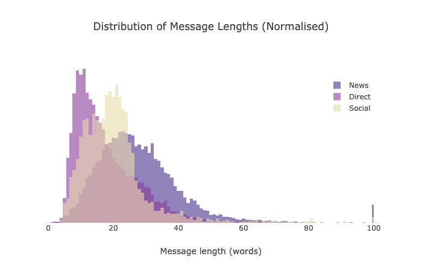
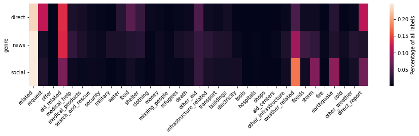

# Disaster Response Pipeline Project

## Context

As part of the Udacity DataScience Nanodegree, I have been provided with labelled disaster-response message (social, news and direct messages).  The goal is to create a classifier app that can classify an unseen message into one or more of ~36 categories (e.g. Infrastructure, Earthquale, Food, Flood etc.).

## Folder Structure
```
.
├── README.md
├── app                                 -- Code for running the app
│   ├── run.py                              -- python web app
│   └── templates
│       ├── go.html                         -- Classification page of app html
│       └── master.html                     -- Homepage of app html
├── data                                -- Input data and cleaned data
│   ├── DisasterResponse.db                 -- cleaned data
│   ├── disaster_categories.csv             -- input data
│   ├── disaster_messages.csv               -- input data
│   ├── example_output.png                  -- image for readme
│   └── process_data.py                     -- script to run data cleansing
├── models                              -- Models
│   ├── classifier.pkl                      -- Saved model
│   └── train_classifier.py                 -- script to rerun model fitting
└── notebooks                           -- Working documents
    ├── ETL\ Pipeline\ Preparation.ipynb
    └── ML\ Pipeline\ Preparation.ipynb
```

## Example training input
> Weather update - a cold front from Cuba that could pass over Haiti

> Is the Hurricane over or is it not over

> Looking for someone but no name

> UN reports Leogane 80-90 destroyed. Only Hospital St. Croix functioning. Needs supplies desperately.

> Please, we need tents and water. We are in Silo, Thank you!

## Output

An example of the output can be seen below. New messages can be classified by running the app locally using `python3 run.py`

<p align="center">

</p>

<p align="center">



</p>

## Details of project
### Data Cleansing ETL

This code is provided in `./data/process_data.py`.

The data is provided in two files, one containing the messages `./data/disaster_messages.csv`, and one containing the labelled categories `./data/disaster_categories.csv`.  Several cleansing steps are necessary:
- Create dummy variables for each of the categories.
- Remove duplicate rows.
- Remove categories which have no labelled data
    *(As we would never be able to predict them, and they cause some ML classifiers to fail).*
- Clean a few messages that have a value of >1 for a given category.
We then write this cleaned data to a local database (filename given as a runtime argument) here: `./data/DisasterResponse.db` in the table `disaster_response`

Re-running the data cleansing can be achieved by running:

```python3 process_data.py disaster_messages.csv disaster_categories.csv <DataBaseFilenameToSaveTo>```

### The ML pipeline

This code is provided in `./models/train_classifier.py`.

The code ingests the data from the local database, then tokenises it, runs it through [TF-IDF](https://scikit-learn.org/stable/modules/generated/sklearn.feature_extraction.text.TfidfTransformer.html), and then in to one of a selection of classifiers.  The `sklearn` classifiers investigated are shown below alongside their scores (with default parameters):

| Classifier | accuracy* | precision  |  recall | f1-score  | support | fit-time (secs) |
|---|---|---|---|---|---|---|
|**Random Forest Classifier**| 0.25 | 0.76    |  0.50  |    0.54 |    20925 |- |
|**MultinomialNB**|   0.17 |  0.56   |   0.38    |  0.39   |  20711 | - |
|**LogisticRegression**|  0.29 | 0.78     | 0.55  |    0.60   | 20711| 43.44 |
|**StochasticGradientDecent**| 0.31 | 0.76  |    0.57  |    0.61  |   20459 | 29.97 |

\*the reason accuracy is low relative to the other score metrics is detailed [here](https://scikit-learn.org/stable/modules/generated/sklearn.metrics.accuracy_score.html), but in essence:

>In multilabel classification, this function computes subset accuracy: the set of labels predicted for a sample must exactly match the corresponding set of labels in y_true.

i.e. it has to get every single label right for each message, which is not necessarily the output we require, as long as it gets some right the classifier can still be useful.

Re-running the ML model build can be achieved by running:

```python3 train_classifier.py  <DataBaseFilenameToLoadFrom> <ClassifierPickleFileToSaveTo>```

#### Grid Search

Having found a classifier we are happy with, we ran Cross Validation over a grid of the following parameters:
```
parameters = {
              'clf4__estimator__loss'    : ['hinge', 'log', 'modified_huber'],
              'clf4__estimator__alpha'   : [0.0001,0.001],
              'clf4__estimator__max_iter': [1000, 2000]
             }
```
and found that the `modified_huber` loss function improved the predictions of the test data, but that the other changes did not make a difference to the fit.

#### Imbalanced labels in training set

As can be seen from the count of messages per category above, there is a large imbalance in the number of training messages we have for each category.  Correcting for this imbalance is an area of active research (e.g. the citations in [this](https://arxiv.org/pdf/1802.05033.pdf) paper).  Essentially, with a naive scoring function for fitting the model, we may end up with a model that classifies "relevant" very well, but is terrible at classifying the more niche "fire" category.

In addition, for certain categories it may be more important to reduce false-positives or reduce false-negatives. For certain categories, it may be more important to capture every instance and *put up with* a few false positives, for these, we should optimise for *recall*.  If, on the other hand, the services that cope with a certain category of messages are inundated with non-relevant messages (too many false-positives), we should optimise that category for *precision*.

#### Further thoughts on the ML fitting

##### More features

As we can see with the example output, there are differences between the sources in terms of the length of messages, also, as can be seen below, there is a skew in the *category* of messages from each source. Here the colorbar is the percentage of all labels that were a particular category, for each genre:

<p align="center">

</p>

As such, we could include both the genre and other features (e.g. the length of the message or amount of puncutation used) in the model as features.  These would be passed to the model using [FeatureUnions](https://scikit-learn.org/stable/modules/generated/sklearn.pipeline.FeatureUnion.html).

##### Different tokenising

At one point in fitting the model, I attempted to remove stop words from the messages. This resulted in halving the fit-score!  This made me think, exploring different tokenising methods (e.g. removing some/all of stemming, lemmatising nouns, lemmatising verbs) should be investigated as a next step.


